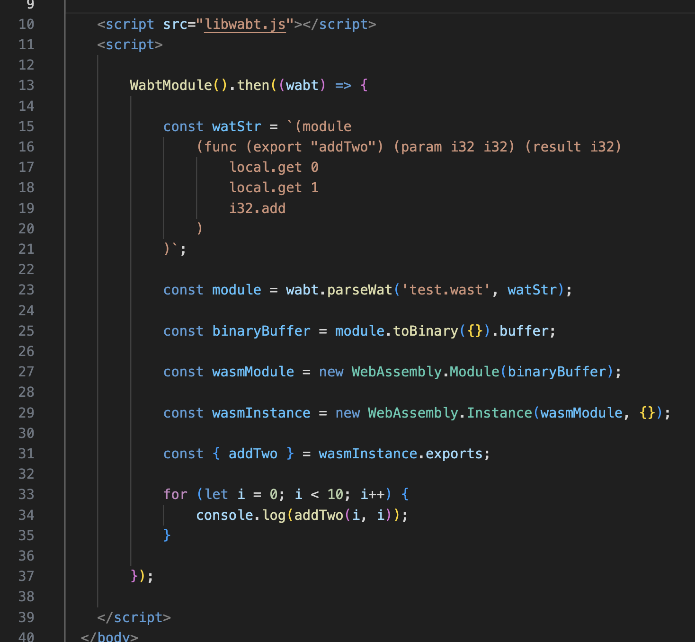
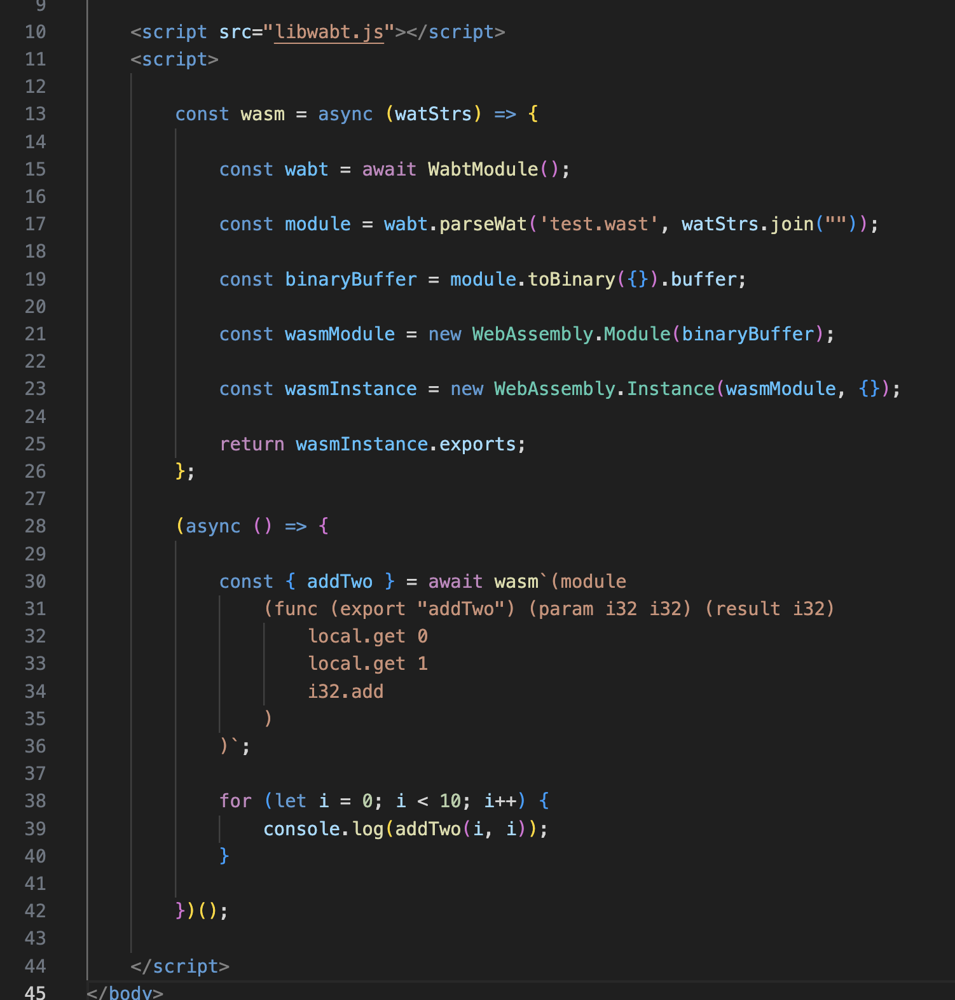

# WorkableWebAssembly

Compile Web Assembly Text to usable JS in One Function that Accepts a String Literal. 

# Compiling Web Assembly Text to a Module

# Using the wasm Tagged Template Literal Function

