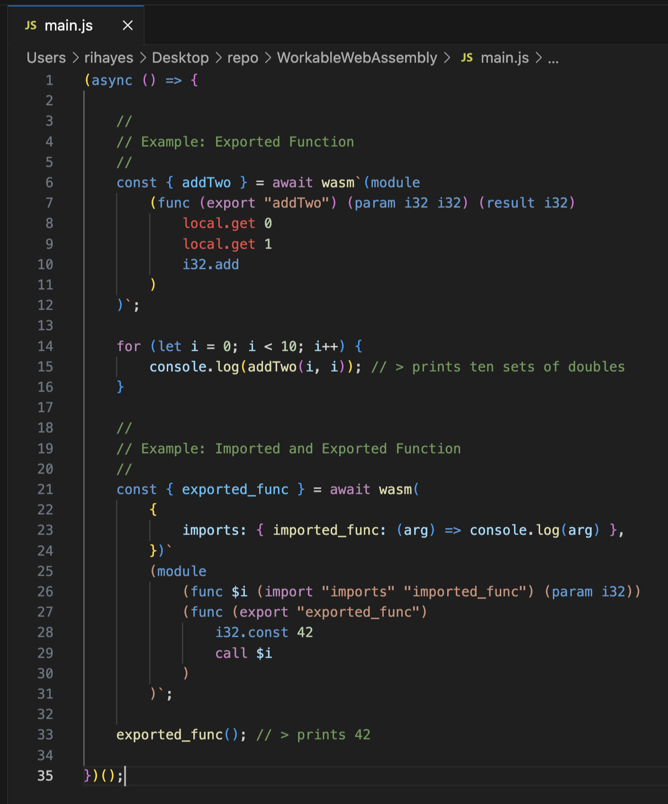

# WorkableWebAssembly

Compile Web Assembly Text to usable JS in One Function that Accepts a String Literal. 

# Example Usage

In the example below, we see a JS program called `main.js` which contains two strings (specifically tagged template strings). Both strings are prefixed with the tagged template function `wasm`. This `wasm` function takes as an argument a template literal string and returns an object containing the functions exported from the compiled Web Assembly Module. Additionally, both Web Assembly Text Strings are syntax highlighted. Also, one can `import` JS functions and memory spaces into their Web Assembly Text program by passing an importObject as seen in the second example below:

# Highlighting Web Assembly Text as Tagged Template Literal Strings inside Javascript Files

Install the `VSIX` file in [this repo](https://github.com/strawstack/WebAssemblySyntaxHighlightTaggedTemplateLiteralVSCodeExtension) into VS Code by choosing the menu option `Install from VSIX...` 
